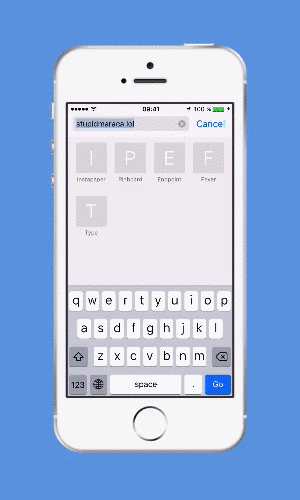

# Stupid Maraca

A maraca for your mobile phone, only in reverse.

This was a project made for the [StupidHackathon 2016](http://www.stupidhackathon.es) and you can [see it live here](https://marcelinollano.github.io/stupid-maraca).

## Demo

You can't grasp this high-concept? [Here is a video](https://marcelinollano.github.io/stupid-maraca/assets/demo.mp4)

## Setup

1. Open the [stupid maraca](https://marcelinollano.github.io/stupid-maraca) on your mobile phone.
2. Add to your home screen: `Status Bar > Add to Home Screen`.
3. Disable silence and turn the volume up!
4. Tap the icon of `Stupid Maraca` to launch it.
4. Chk chk chk, shake the device!

## FAQ

**Q: Who made this?**  
**A:** It was [@denegro](https://twitter.com/denegro)'s original idea and he also did the cute graphics. [@ferblape](https://twitter.com/ferblape) and [@marcelinollano](https://twitter.com/marcelinollano) implemented the thing, mostly copying from Stack Overflow. [@kekoponte](https://twitter.com/kekoponte) and [@coquedesigns](https://twitter.com/coquedesigns) did the testing and emotional support.

**Q: My maraca does not sound, why?**  
**A:** You must add it to your home screen (see step 2 in the `Setup` section). Mobile browsers limit the access to features of the device. The HTML5 Audio API only works if the webapp is installed on the home screen, or so it seems.

**Q: It this great product free?**  
**A:** Yep, but we may add some in-app purchases to unlock more maracas.
